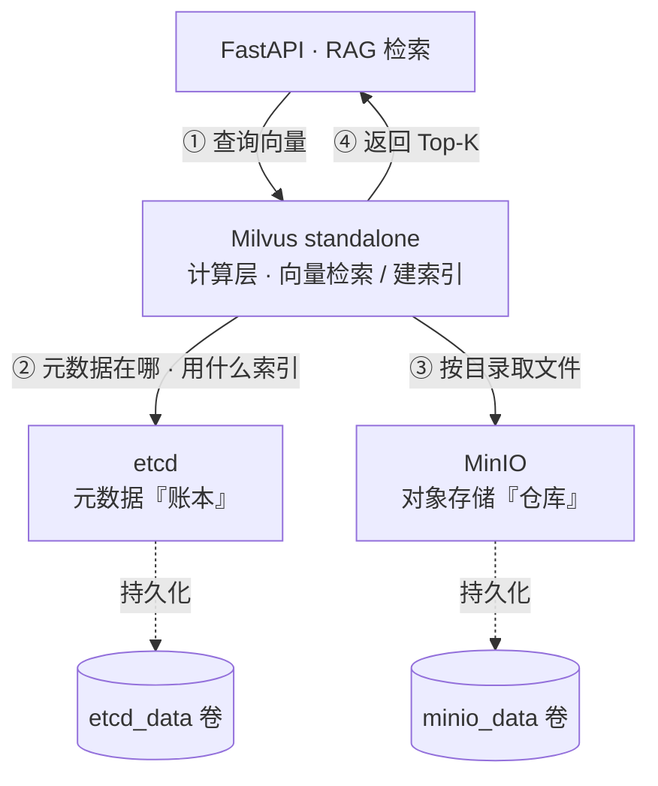

# NutriCore 架构说明

## 1. 总体架构

```
                          ┌───────────────────────────────────────────┐
                          │             FastAPI Gateway               │
                          │  /chat  /screening  /plan  /insight       │
                          └────────────────┬──────────────────────────┘
                                           │
                          ┌────────────────▼──────────────────────────┐
                          │       AI 营养师 Agent (LangGraph)         │
                          │  ┌──────────┐  ┌─────────────┐            │
                          │  │ 意图识别 │→ │ 子 Agent 路由│           │
                          │  └──────────┘  └─────┬───────┘            │
                          │   ▲                  │                    │
                          │   │     ┌────────────▼──────────┐         │
                          │   │     │ Function Calling 工具 │         │
                          │   │     │ (BMI/能量/食谱/禁忌…)  │         │
                          │   │     └────────────┬──────────┘         │
                          │   │                  ▼                    │
                          │   │      ┌──────────────────────┐         │
                          │   │      │  引用核验 / 安全兜底  │         │
                          │   │      └──────────────────────┘         │
                          │   │                                       │
                          │   └─── 多轮记忆 / 用户画像 (实体抽取) ────┤
                          └────────────────┬──────────────────────────┘
                                           │ StructuredTool
       ┌───────────────────┬───────────────┴───────────────┬────────────────────┐
       ▼                   ▼                               ▼                    ▼
┌──────────────┐  ┌─────────────────┐         ┌────────────────────┐  ┌────────────────┐
│ 营养风险筛查 │  │ 个性化营养方案  │         │   健康数据洞察     │  │ 其它工具调用    │
│  Agent       │  │  Agent          │         │   Agent (Dify)     │  │ (基础工具)     │
│ (NRS2002)    │  │ (RAG + PDF)     │         │ (Vanna.ai NL2SQL)  │  │                │
└──────┬───────┘  └────────┬────────┘         └─────────┬──────────┘  └────────────────┘
       │                   │                            │
       ▼                   ▼                            ▼
┌──────────────────────────────────────────────────────────────────────────┐
│  数据 / 模型层                                                            │
│  Milvus (向量)  ·  MySQL (业务 / 画像)  ·  Redis (会话缓存)              │
│  MinIO (PDF / 报告)  ·  vLLM (大模型私有化)  ·  BGE Embedding / Rerank   │
└──────────────────────────────────────────────────────────────────────────┘
```

## 2. 主 Agent 状态机

```
START ──▶ intent_router ──┬─▶ safety_fallback ──▶ END  (高风险)
                          │
                          └─▶ subagent_dispatcher ──▶ tool_executor ──▶ citation_validator ──▶ END
```

- **intent_router**：调用 LLM Function Calling，输出 `intent / selected_subagent / is_high_risk`
- **subagent_dispatcher**：将上下文派发至「筛查 / 方案 / 洞察」中的一个子 Agent
- **tool_executor**：实际调用 Function Calling 工具，写入审计日志
- **citation_validator**：校验返回内容中的引用均能映射到知识库
- **safety_fallback**：高风险（用药 / 急重症 / 孕产期）兜底话术

## 3. RAG 链路

```
原始资料  ──切分──▶ 元数据增强 ──Embedding──▶ Milvus
                                  │
查询 ─┬─ BM25 召回 ──┐             │
      │              │             │
      └─ BGE 向量召回┘──RRF 融合──▶ Cross-Encoder 精排 ──▶ 生成链
                                                          │
                                              引用强约束校验
```

- 召回率：Top-20 从 ~75% 提升至 **90%+**

## 4. 数据隔离（Data Insight）

| 防护层      | 说明                                         |
| ----------- | -------------------------------------------- |
| SELECT-only | 拦截一切 UPDATE / DELETE / DROP …            |
| 字段白名单  | 仅返回授权字段                               |
| user_id 过滤 | 所有 WHERE 子句必须包含 `user_id = '<self>'` |

## 5. 评测看板

| 模块 | 指标 |
| ---- | ---- |
| 筛查 | 评分准确率 · 报告完整度 · 复测一致性 |
| 方案 | 召回 Top-K · 引用命中率 · 方案合规率 |
| 洞察 | SQL 准确率 · 图表成功率 · 解读可读性 |

## 6. 数据基建：Milvus 存算分离

向量检索(RAG 知识库)依赖 Milvus，而 Milvus 是**存算分离**架构：自身只做计算
（向量检索 / 建索引），把「元数据」和「实际数据」分别交给 **etcd** 和 **MinIO**。
三者是一套，缺一个 Milvus 起不来 —— 对应 `docker-compose.yml` 里 `milvus`
的 `depends_on: etcd + minio`。



> 框内只标组件角色,各自「存什么」见下表(避免节点框过宽)。

| 组件 | 职责 | 存什么 | 类比 |
| ---- | ---- | ------ | ---- |
| **Milvus** | 计算:接收查询、做 ANN 向量检索、建索引 | 不落盘(数据都委托出去) | 图书管理员 |
| **etcd** | 强一致的分布式 KV，存协调性元数据 | collection/schema、索引信息、segment 位置目录、各节点状态 | 索引卡片柜 |
| **MinIO** | S3 兼容对象存储 | 向量本体、索引文件、binlog | 书架（仓库） |

**一次检索的路径**：营养咨询触发 RAG → Milvus 先问 etcd「这个 collection 的 segment
在哪、用什么索引」→ 再去 MinIO 把对应文件取出来算 → 返回 Top-K。

> 实务影响：etcd / MinIO 任一不健康，Milvus 就无法服务，RAG 引用检索随之失效；
> 因此 compose 用 healthcheck + `depends_on: condition: service_healthy` 保证启动顺序。
> MySQL(画像/业务)、Redis(短期记忆/缓存)与这套向量基建相互独立。
